# TOURAPP — A Flutter Application for Virtual Tour

**Timeline:** Oct 2021 - Dec 2021 

TourApp is a Flutter-based mobile application designed to provide users with a **virtual tour experience**. 
It combines modern UI/UX with **image recognition, 360° video playback, and map integration** to make exploring places interactive and engaging. 

---

##  Features
- 📷 View images of tourist attractions 
- 🎥 Enjoy **360° immersive videos** 
- 🏞️ Explore **facts with supporting images** 
- 🔍 Search places by:
  - Text query 
  - Image recognition (CNN-based) 
  - UI navigation 
- 🗺️ Map integration for location-based exploration 

---

## 🛠️ Tech Stack
- **Flutter** — Cross-platform mobile development 
- **TensorFlow & Keras** — Convolutional Neural Networks (image recognition) 
- **Firebase** — Backend services & authentication 
- **Google Maps API** — Map integration 

---

## 📸 Screenshots & Demo

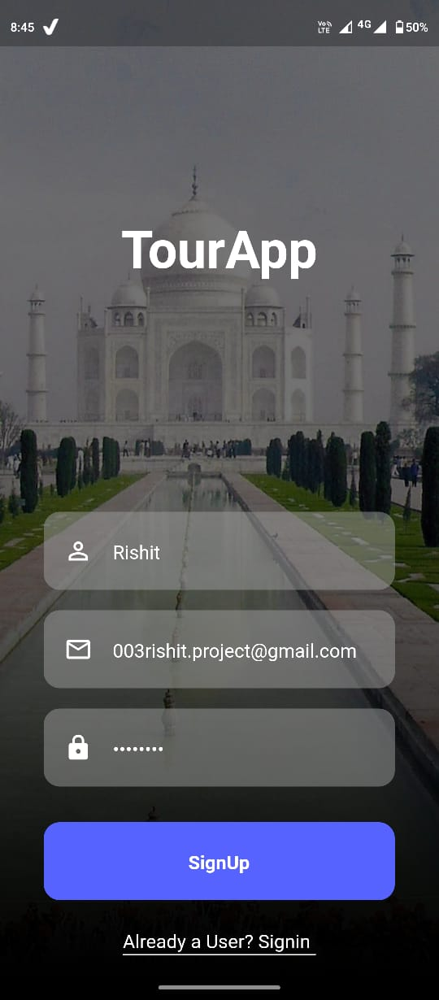
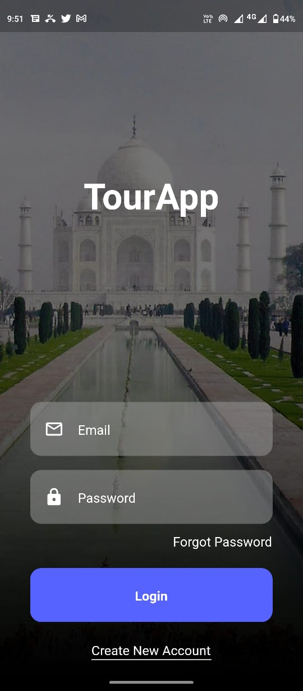
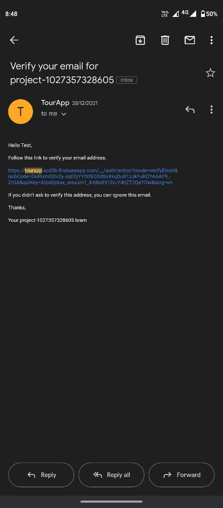
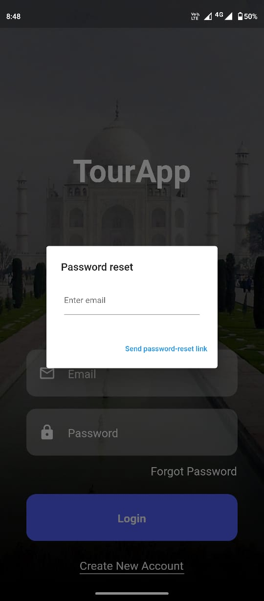

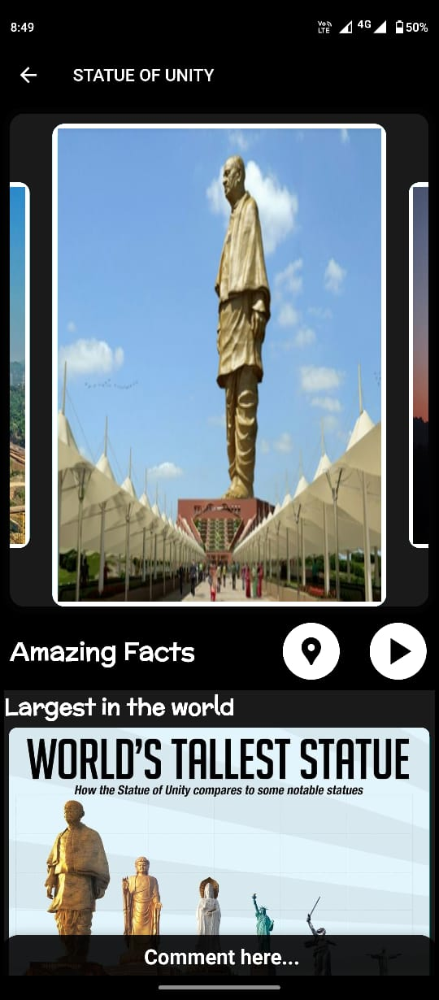
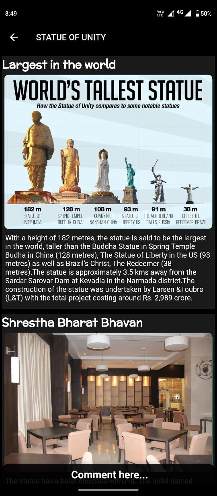
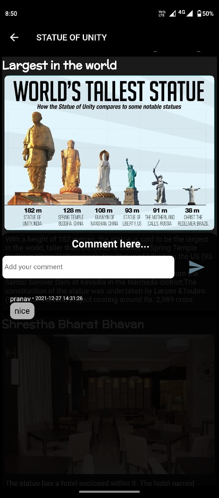

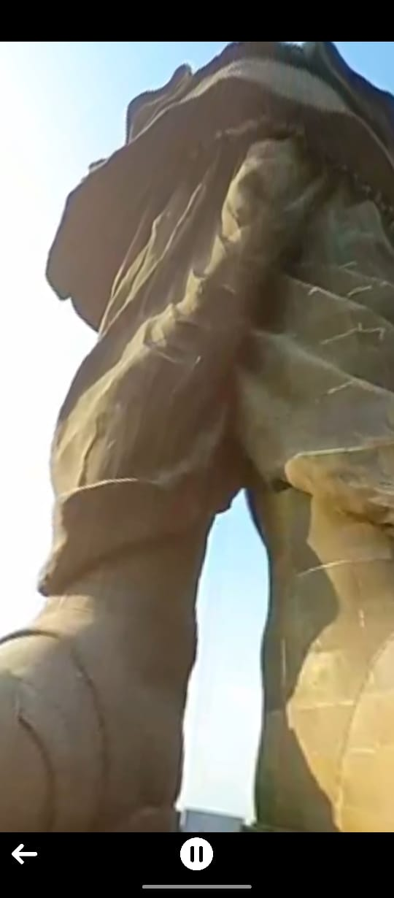
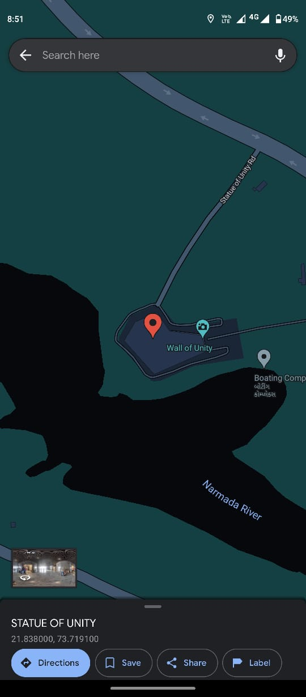
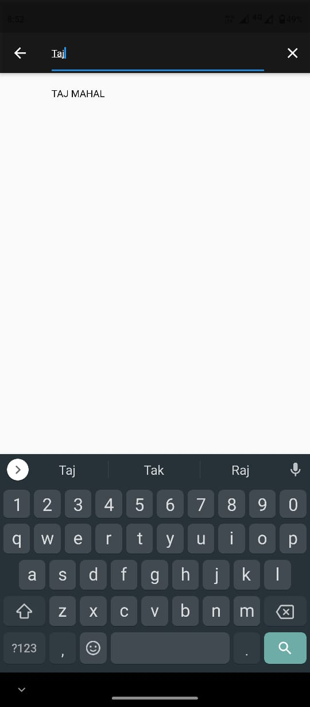
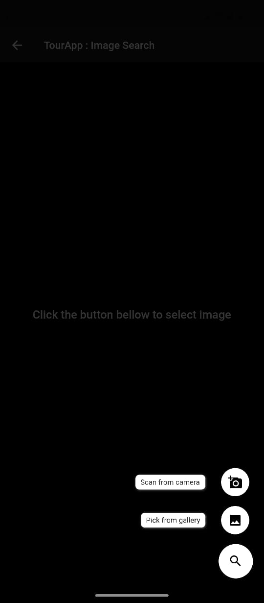
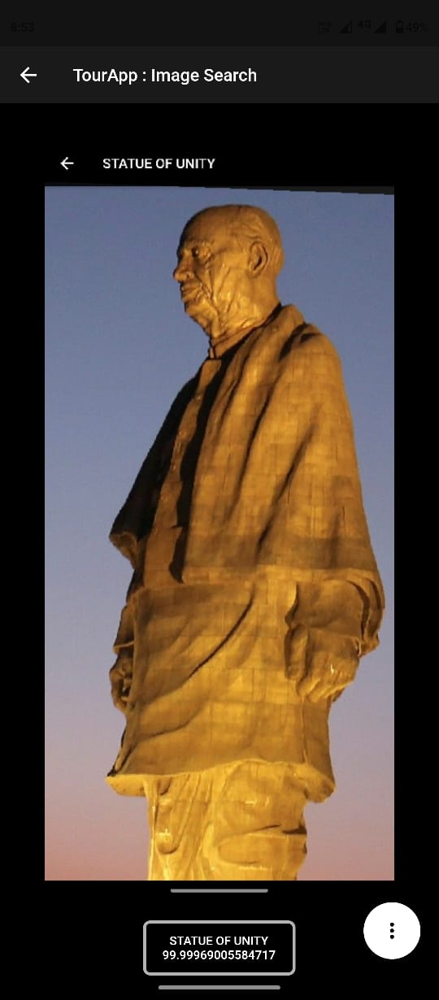

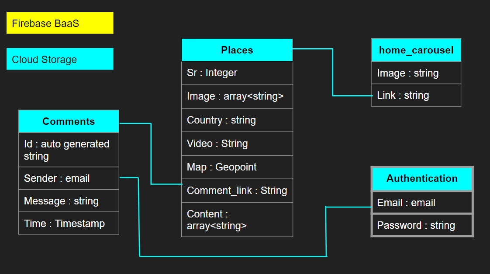
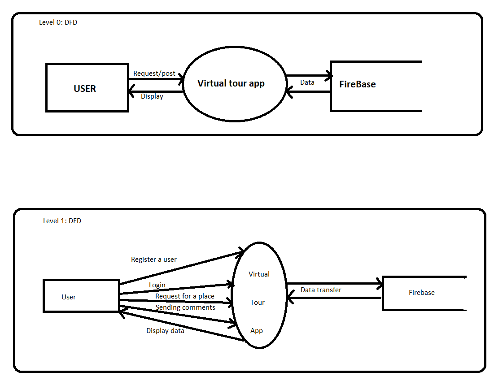
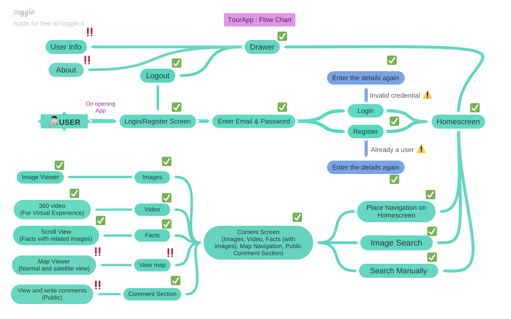
